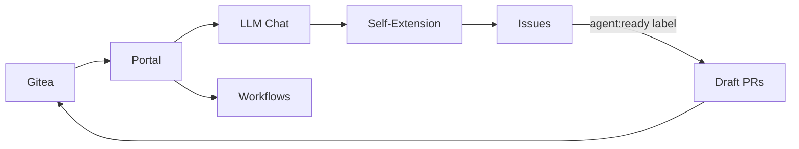

# Forge0

[](LICENSE)

A self-hosted development control plane built on Gitea. Forge0 gives you a FastAPI/HTMX portal with project-aware LLM chat, SearXNG search, and deterministic workflow primitives — plus a self-extension engine that turns issues into draft pull requests.



## Key Features

- **Project-Aware LLM Chat** — ask questions about your codebase with full context
- **SearXNG Integration** — private, self-hosted web search from the portal
- **Deterministic Workflows** — composable workflow primitives for repeatable tasks
- **Self-Extension** — issues labeled `agent:ready` become verified draft PRs automatically
- **Experiment Tracking** — optional W&B and Optuna integration for model tuning
- **Reusable Agent Skills** — modular, shareable capabilities for AI agents
- **OAuth + Session Auth** — Gitea-backed authentication with PKCE

## Architecture

| Component | Role |
|---|---|
| **Portal** | FastAPI/HTMX web interface; proxies Gitea, serves chat and workflow UIs |
| **Dogfood Engine** | Listens for labeled issues, plans, implements, runs checks, opens draft PRs |
| **Agents** | Planner, worker, and critic LLM roles with budget/lock/stuck-detection controls |
| **Experiments** | Optional W&B/Optuna profiles for tracking model runs and hyperparameter sweeps |

## Quick Start

Requirements: Docker Engine with Compose v2, `curl`, and Python 3.

```bash
cp .env.example .env
# Set OPENCODE_API_KEY and change passwords in .env
docker compose up -d gitea
./setup.sh
```

Open the portal at **http://localhost:3001**. Gitea is proxied at `/gitea/`.

Optional services:

```bash
docker compose --env-file .env.generated --profile observability up -d wandb
docker compose --env-file .env.generated --profile optimization run --rm optuna
```

## Configuration

Key settings in [`.env.example`](.env.example):

| Variable | Purpose |
|---|---|
| `OPENCODE_API_KEY` | LLM API key for project chat |
| `FORGE0_ALLOWED_USERS` | Comma-separated Gitea usernames allowed into the portal |
| `FORGE0_SELF_REPO` | Repository for self-extension (default `agent/forge0`) |
| `FORGE0_MAX_CONCURRENT_RUNS` | Parallel self-extension runs (default `1`) |

## Self-Extension

1. Publish this repo to your Gitea instance
2. Rerun `./setup.sh` to install the webhook and labels
3. Create an issue with `## Acceptance Criteria` and add the `agent:ready` label

Forge0 clones, plans, implements, runs tests/Ruff/Pyright, gets critic approval, then opens a draft PR. It never merges its own work.

## Development

```bash
python3 -m venv .venv
. .venv/bin/activate
pip install -r portal/requirements.txt -r portal/requirements-dev.txt
pytest
ruff check .
pyright portal/app
```

## License

[MIT](LICENSE)
