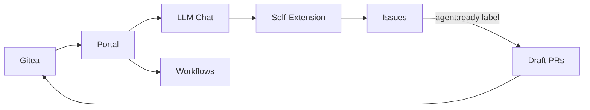
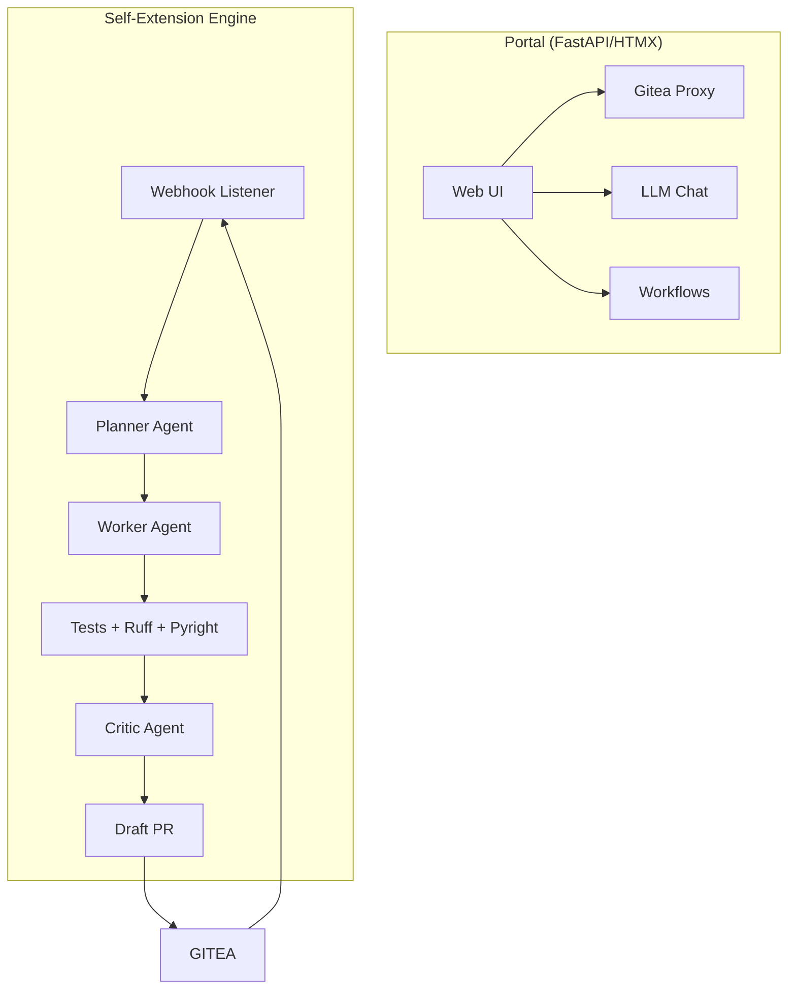

# Forge0

[](LICENSE)
[](./docker-compose.yaml)
[]()

> **Your platform can improve itself.**

Forge0 is a self-hosted dev platform built on Gitea with a self-extension engine that turns issues into draft pull requests. It's not just a tool — it's a dogfooding system. Create an issue, label it `agent:ready`, and Forge0 clones, plans, implements, runs tests, and opens a draft PR. The platform improves itself.



## Features

| Feature | Description |
|---|---|
| **Self-Extension** | Issues labeled `agent:ready` become verified draft PRs automatically |
| **Project-Aware LLM Chat** | Ask questions about your codebase with full context |
| **SearXNG Integration** | Private, self-hosted web search from the portal |
| **Deterministic Workflows** | Composable workflow primitives for repeatable tasks |
| **Agent Roles** | Planner, worker, and critic LLM roles with budget/lock/stuck-detection |
| **Experiment Tracking** | Optional W&B and Optuna integration for model tuning |
| **Reusable Agent Skills** | Modular, shareable capabilities for AI agents |
| **OAuth + Session Auth** | Gitea-backed authentication with PKCE |

## Architecture

| Component | Role |
|---|---|
| **Portal** | FastAPI/HTMX web interface; proxies Gitea, serves chat and workflow UIs |
| **Dogfood Engine** | Listens for labeled issues, plans, implements, runs checks, opens draft PRs |
| **Agents** | Planner, worker, and critic LLM roles with budget/lock/stuck-detection controls |
| **Experiments** | Optional W&B/Optuna profiles for tracking model runs and hyperparameter sweeps |



## Quick Start

Requirements: Docker Engine with Compose v2, `curl`, and Python 3.

```bash
# 1. Clone and configure
git clone https://github.com/jajmangold/forge0.git
cd forge0
cp .env.example .env
# Edit .env — set OPENCODE_API_KEY and change passwords

# 2. Launch Gitea and run setup
docker compose up -d gitea
./setup.sh

# 3. Open the portal
# http://localhost:3001 (portal)
# http://localhost:3001/gitea/ (Gitea)
```

## Self-Extension

1. Publish this repo to your Gitea instance
2. Rerun `./setup.sh` to install the webhook and labels
3. Create an issue with `## Acceptance Criteria` and add the `agent:ready` label

Forge0 clones, plans, implements, runs tests/Ruff/Pyright, gets critic approval, then opens a draft PR. **It never merges its own work.**

## Configuration

Key settings in [`.env.example`](.env.example):

| Variable | Purpose |
|---|---|
| `OPENCODE_API_KEY` | LLM API key for project chat |
| `FORGE0_ALLOWED_USERS` | Comma-separated Gitea usernames allowed into the portal |
| `FORGE0_SELF_REPO` | Repository for self-extension (default `agent/forge0`) |
| `FORGE0_MAX_CONCURRENT_RUNS` | Parallel self-extension runs (default `1`) |

Optional services:

```bash
docker compose --env-file .env.generated --profile observability up -d wandb
docker compose --env-file .env.generated --profile optimization run --rm optuna
```

## Development

```bash
python3 -m venv .venv
. .venv/bin/activate
pip install -r portal/requirements.txt -r portal/requirements-dev.txt
pytest
ruff check .
pyright portal/app
```

## Contributing

1. Fork the repo
2. Create a feature branch
3. Make changes, run `pytest && ruff check . && pyright portal/app`
4. Open a PR

## License

MIT — see [`LICENSE`](LICENSE).
